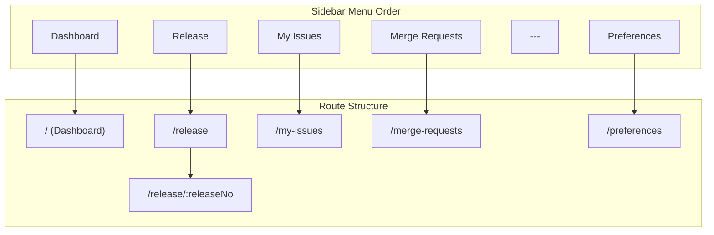

# Release, MR Integration, Dashboard & Header Features

## 1. Bổ sung Route "Release" + UI dummy data

### Phân tích từ wireframe (hình 1)

- Header: filter theo **Năm** (Select dropdown, mặc định 2026) + nút **Create**
- Table: cột **No**, **Release No**, **Date**, **Actions** (Send, Details, Edit)
- Sắp xếp: "Sort mới nhất" (newest first)
- Phân trang: 20 items/page

### Files cần tạo/sửa

**Sửa** [src/constants/routeNames.ts](src/constants/routeNames.ts):

- Thêm `RELEASE: 'release'` và `RELEASE_DETAIL: 'release-detail'` vào `ROUTE_NAMES`
- Thêm `RELEASE: '/release'` vào `ROUTE_PATHS`

**Tạo** `src/router/modules/release.routes.ts`:

- Route `/release` -> `ReleaseView.vue` (danh sách)
- Route `/release/:releaseNo` -> `ReleaseDetailView.vue` (chi tiết theo release number, ví dụ `/release/103`)

**Sửa** [src/router/index.ts](src/router/index.ts):

- Import `releaseRoutes` và thêm vào `children` array: `...releaseRoutes`

**Sửa** [src/config/navigation.ts](src/config/navigation.ts):

- Thêm item Release (`pi pi-box` icon) **trước** item "My Issues" trong group "General"

**Sửa** locales ([en.ts](src/locales/en.ts), [vi.ts](src/locales/vi.ts), [ko.ts](src/locales/ko.ts)):

- Thêm `menu.release: 'Release'` / `'Phát hành'` / `'릴리스'`
- Thêm section `release` với các key: `title`, `year`, `releaseNo`, `date`, `actions`, `send`, `details`, `edit`, `create`, `noReleases`, `noReleasesMessage`, `paginatorReport`

**Tạo** `src/views/Release/ReleaseView.vue`:

- Layout tham khảo `MyIssuesView.vue`: filter card (Select năm + nút Create) + table card
- Sử dụng PrimeVue DataTable, Card, Select, Button
- Dummy data: 6 release items (No 1-6, Release No 100-105, Date, Actions)

**Tạo** `src/views/Release/partials/ReleaseFilter.vue`:

- Select cho năm (2024, 2025, 2026) + Button "Create"
- Tham khảo pattern `MyIssuesFilter.vue`

**Tạo** `src/views/Release/partials/ReleaseTable.vue`:

- DataTable với cột: No, Release No, Date, Actions (Send, Details, Edit)
- Tham khảo pattern `MyIssuesTable.vue`
- Click "Details" navigate tới `/release/:releaseNo`

**Tạo** `src/views/Release/ReleaseDetailView.vue`:

- Placeholder view hiển thị release number từ route param
- Nút Back để quay về danh sách

---

## 2. Dashboard HomeView

### Files cần sửa

**Sửa** [src/views/Home/HomeView.vue](src/views/Home/HomeView.vue):

- Xóa nội dung placeholder hiện tại
- Thêm navigation cards dạng grid sử dụng PrimeVue Card component
- Mỗi card đại diện cho một route: My Issues, Merge Requests, Release, Preferences
- Mỗi card gồm: icon, title, description ngắn, click navigate đến route tương ứng
- Sử dụng `useRouterNavigation` để điều hướng
- Responsive grid layout (2 cột trên desktop, 1 cột trên mobile)

**Sửa** locales:

- Thêm `dashboard` section với description cho mỗi card

---

## 3. LanguageSwitcher trong AppHeader

### Files cần sửa

**Sửa** [src/components/layouts/AppHeader.vue](src/components/layouts/AppHeader.vue):

- Import `LanguageSwitcher` từ `@/components/common`
- Đặt `<LanguageSwitcher />` trong `app-header__right`, **trước** `app-header__user` div
- Thêm gap phù hợp trong CSS

---

## 4. Integrate API MergeRequests + UI

### Phân tích từ wireframe (hình 2) và API response

- Cột: ID, Merge Title, Assignee, Source Branch Flow (source -> target), Reviews (reviewers + approved), Action (AI Review, Merge)
- Endpoint: `POST api/read/v1/GitLab/MergeRequest` với payload `{ projectId: 64741346 }`

### Files cần tạo/sửa

**Sửa** [src/types/gitlab.ts](src/types/gitlab.ts):

- Thêm interface `MergeRequestItem` (id, mergeRequestId, title, description, assignee, sourceBranch, targetBranch, webUrl, createdAt, updatedAt, milestone, reviewers, approvedBy, author - tất cả fields từ API response)
- Thêm interface `MergeRequestListResult` (`mergeRequests: MergeRequestItem[]`)
- Thêm interface `MergeRequestListRequest` (`projectId: number`)

**Sửa** [src/api/services/gitlab.ts](src/api/services/gitlab.ts):

- Thêm method `getMergeRequests(request: MergeRequestListRequest): Promise<ApiResponse<MergeRequestListResult>>`
- Sử dụng `gatewayService.read(GITLAB_SERVICE, 'MergeRequest', request, { skipLoading: true })`

**Tạo** `src/views/MergeRequests/composables/useMergeRequests.ts`:

- Tham khảo pattern `useMyIssues.ts`
- State: `mergeRequests`, `loadingMergeRequests`, `filters` (projectId)
- Method: `fetchMergeRequests()`
- Error handling theo pattern hiện tại

**Tạo** `src/views/MergeRequests/partials/MergeRequestsFilter.vue`:

- Filter cho project (Select), tham khảo `MyIssuesFilter.vue`

**Tạo** `src/views/MergeRequests/partials/MergeRequestsTable.vue`:

- Tham khảo `MyIssuesTable.vue`
- Cột: ID (mergeRequestId, link tới webUrl), Merge Title (title + meta info), Assignee (avatar + name), Source Branch Flow (sourceBranch -> targetBranch), Reviews (reviewers avatars + approved count), Action (AI Review button, Merge button)

**Sửa** [src/views/MergeRequests/MergeRequestsView.vue](src/views/MergeRequests/MergeRequestsView.vue):

- Orchestrate filter + table giống `MyIssuesView.vue`
- Gọi `fetchMergeRequests` on mount

**Sửa** locales:

- Thêm section `mergeRequests` với các key cho filter, table headers, actions, empty state

---

## Kiến trúc tổng quan

## Review Checklist (sau khi implement)

- Kiểm tra LanguageSwitcher hiển thị đúng vị trí trong AppHeader
- Kiểm tra sidebar menu: Release nằm trên My Issues
- Kiểm tra route `/release/:releaseNo` nhận đúng param
- Kiểm tra API call MergeRequests trả về đúng data
- Kiểm tra i18n đầy đủ 3 ngôn ngữ (en, vi, ko)
- Kiểm tra responsive trên mobile
- Kiểm tra linter errors

