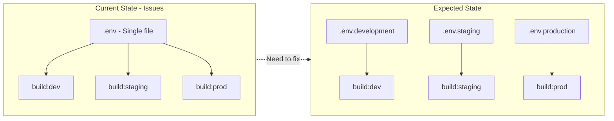
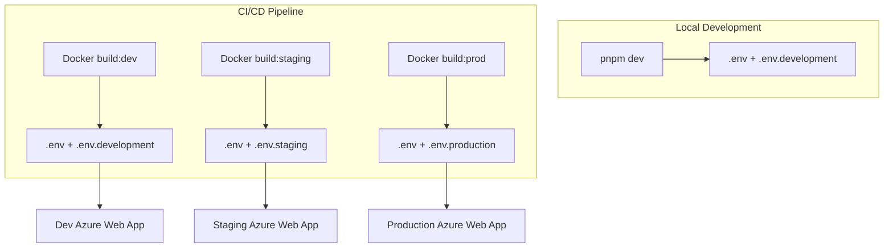

# Multi-Environment Setup for Vue 3 + Vite Project

## Current State Analysis

### Project Structure (Strengths)

Cấu trúc hiện tại đã tốt với separation of concerns rõ ràng:

```
src/
├── composables/    # Business logic hooks
├── services/       # API layer
├── stores/         # Pinia state management
├── views/          # Page components
├── components/     # Reusable UI components
├── types/          # TypeScript definitions
├── constants/      # Application constants
├── plugins/        # Third-party integrations (axios, i18n, PrimeVue)
├── router/         # Route configuration
└── utils/          # Pure utility functions
```

### Environment Configuration Issues



**1. Single `.env` file with hardcoded dev URLs:**

```1:10:Application/VueJS/.env
VITE_SALONADMIN_SOLUTION_ID=3003
VITE_HEADQUARTERADMIN_GATEWAY_BASEURL=https://ahasoft-salon-admin-http-aggregator-dev.azurewebsites.net
```

**2. Build scripts exist but share same env file:**

```6:12:Application/VueJS/package.json
"scripts": {
    "dev": "vite",
    "build": "pnpm build:prod",
    "build:prod": "cross-env NODE_ENV=production vite build",
    "build:dev": "cross-env NODE_ENV=development vite build",
    "build:staging": "cross-env NODE_ENV=staging vite build",
```

**3. Missing TypeScript types for env variables:**

Current `env.d.ts` doesn't define `ImportMetaEnv` interface.

**4. Docker builds correctly reference different scripts:**

- Development: `pnpm run build:dev`
- Staging: `pnpm run build:staging`
- Production: `pnpm run build:prod`

---

## Implementation Plan

### 1. Create Environment-Specific `.env` Files

Create 4 files in `Application/VueJS/`:

| File | Purpose | Loaded When |

|------|---------|-------------|

| `.env` | Shared defaults | Always |

| `.env.development` | Local dev values | `pnpm dev` or `--mode development` |

| `.env.staging` | Staging URLs | `--mode staging` |

| `.env.production` | Production URLs | `--mode production` |

**Example `.env.development`:**

```env
# Environment identifier
VITE_APP_ENV=development

# API Gateway
VITE_HEADQUARTERADMIN_GATEWAY_BASEURL=https://ahasoft-salon-admin-http-aggregator-dev.azurewebsites.net

# SignalR
VITE_NOTIFICATION_READ_API_BASEURL=https://ahasoft-salon-solution-notification-dev.service.signalr.net/client/?hub=salonheadquarter

# Azure Storage
VITE_AZURE_STORAGE_BOARD_URL=https://ahasoftsaloncommondev.blob.core.windows.net/boards/

# Debug flags
VITE_ENABLE_DEVTOOLS=true
VITE_ENABLE_SENTRY=false
```

**Example `.env.production`:**

```env
# Environment identifier
VITE_APP_ENV=production

# API Gateway
VITE_HEADQUARTERADMIN_GATEWAY_BASEURL=https://ahasoft-salon-admin-http-aggregator.azurewebsites.net

# Debug flags
VITE_ENABLE_DEVTOOLS=false
VITE_ENABLE_SENTRY=true
```

### 2. Update TypeScript Environment Types

Update [env.d.ts](Application/VueJS/env.d.ts):

```typescript
/// <reference types="vite/client" />

interface ImportMetaEnv {
  // Environment
  readonly VITE_APP_ENV: 'development' | 'staging' | 'production'
  
  // API Configuration
  readonly VITE_SALONADMIN_SOLUTION_ID: string
  readonly VITE_HEADQUARTERADMIN_GATEWAY_BASEURL: string
  readonly VITE_HEADQUARTERADMIN_GATEWAY_VERSION: string
  readonly VITE_NOTIFICATION_READ_API_BASEURL: string
  
  // Service names and versions
  readonly VITE_ADMINS_SERVICE_NAME: string
  readonly VITE_ADMINS_READ_API_VERSION: string
  readonly VITE_ADMINS_CMD_API_VERSION: string
  // ... other service configs
  
  // Azure Storage
  readonly VITE_AZURE_STORAGE_BOARD_URL: string
  readonly VITE_AZURE_STORAGE_CLIENT_URL: string
  readonly VITE_AZURE_STORAGE_ADMINS_URL: string
  
  // Feature flags
  readonly VITE_ENABLE_DEVTOOLS: string
  readonly VITE_ENABLE_SENTRY: string
  
  // Third-party keys
  readonly VITE_IAMPORT_KEY: string
  readonly VITE_HEADQUARTER_ADMIN_SENTRY_DSN: string
}

interface ImportMeta {
  readonly env: ImportMetaEnv
}
```

### 3. Update Build Scripts in package.json

Change from `NODE_ENV` to Vite's `--mode` flag:

```json
{
  "scripts": {
    "dev": "vite --mode development",
    "build": "pnpm build:prod",
    "build:dev": "vite build --mode development",
    "build:staging": "vite build --mode staging",
    "build:prod": "vite build --mode production",
    "preview": "vite preview",
    "preview:staging": "vite preview --mode staging"
  }
}
```

### 4. Update Vite Configuration

Update [vite.config.ts](Application/VueJS/vite.config.ts):

```typescript
import { defineConfig, loadEnv } from 'vite'

export default defineConfig(({ mode }) => {
  const env = loadEnv(mode, process.cwd(), '')
  
  return {
    plugins: [
      vue(),
      vueDevTools({
        enabled: env.VITE_ENABLE_DEVTOOLS === 'true'
      }),
      mode === 'production' && removeConsole(),
      // ... other plugins
    ].filter(Boolean),
    
    define: {
      __APP_ENV__: JSON.stringify(mode),
    },
    
    build: {
      sourcemap: mode !== 'production',
      minify: mode === 'production' ? 'esbuild' : false,
    },
    // ... rest of config
  }
})
```

### 5. Create Environment Utility (Optional)

Create `src/utils/environment.ts`:

```typescript
export const ENV = {
  isDevelopment: import.meta.env.VITE_APP_ENV === 'development',
  isStaging: import.meta.env.VITE_APP_ENV === 'staging',
  isProduction: import.meta.env.VITE_APP_ENV === 'production',
  
  apiBaseUrl: import.meta.env.VITE_HEADQUARTERADMIN_GATEWAY_BASEURL,
  enableDevtools: import.meta.env.VITE_ENABLE_DEVTOOLS === 'true',
  enableSentry: import.meta.env.VITE_ENABLE_SENTRY === 'true',
} as const
```

### 6. Update .gitignore

Add local env overrides:

```gitignore
# Environment files
.env.local
.env.*.local
```

---

## Environment Flow Diagram



---

## Files to Create/Modify

| Action | File Path | Description |

|--------|-----------|-------------|

| Create | `.env.development` | Development environment variables |

| Create | `.env.staging` | Staging environment variables |

| Create | `.env.production` | Production environment variables |

| Modify | `.env` | Keep only shared/default values |

| Modify | `env.d.ts` | Add TypeScript types for env vars |

| Modify | `package.json` | Update build scripts to use `--mode` |

| Modify | `vite.config.ts` | Add mode-aware configuration |

| Modify | `.gitignore` | Add `.env.*.local` patterns |

| Create | `src/utils/environment.ts` | Optional: centralized env access |

---

## Security Notes

- **Never commit** `.env.local` or `.env.*.local` files
- Use Azure Key Vault or pipeline variables for sensitive values in CI/CD
- Current `.env` is committed - move sensitive values (Sentry DSN, IAMPORT_KEY) to pipeline variables for production
