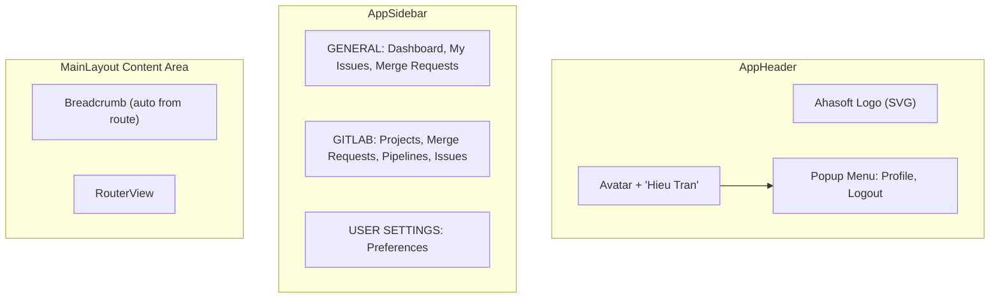

# Layout UI Enhancement Plan

## Current State

- **AppHeader**: Uses GitLab logo (`logo-gitlab.png`), right side has a plain logout button
- **AppSidebar**: Two groups (GENERAL: Dashboard; GITLAB: Projects, Merge Requests, Pipelines, Issues). Active route highlighting already works via `isActive` class
- **MainLayout**: No breadcrumb. Content area renders `<RouterView />` directly
- **Routes**: Only `home` route exists in `home.routes.ts`. `ROUTE_NAMES` has HOME, LOGIN, NOT_FOUND
- **Theme**: Full theme config exists in `src/plugins/primevue.ts` with `ThemeExamples.vue` as reference

## Target State




## Files to Modify

### 1. `[src/constants/routeNames.ts](src/constants/routeNames.ts)` -- Add route names

- Add `MY_ISSUES`, `MERGE_REQUESTS`, `PREFERENCES` to `ROUTE_NAMES`

### 2. `[src/types/router.ts](src/types/router.ts)` -- Extend RouteMeta

- Add optional `breadcrumb?: string` field to `RouteMeta` for custom breadcrumb labels (falls back to `title`)

### 3. `[src/router/modules/home.routes.ts](src/router/modules/home.routes.ts)` -- Add new routes

- Add routes for `/my-issues`, `/merge-requests`, `/preferences` as children of the MainLayout parent
- Each route gets `meta.title` and `meta.breadcrumb` for breadcrumb display

### 4. `[src/components/layouts/AppHeader.vue](src/components/layouts/AppHeader.vue)` -- Logo + user dropdown

- Replace `logo-gitlab.png` import with `logo-ahasoft.svg`
- Replace logo text "GitLab Tool" with "Ahasoft" (or remove text, SVG contains full branding)
- Replace right-side logout button with: `Avatar` (label "HT") + "Hieu Tran" text + click to toggle PrimeVue `Menu` with `popup: true`
- Menu items: "Profile" (icon: `pi pi-user`), separator, "Logout" (icon: `pi pi-sign-out`, triggers existing `handleLogout`)

PrimeVue popup Menu pattern:

```vue
<div class="app-header__user" @click="toggleUserMenu">
  <Avatar label="HT" shape="circle" />
  <span class="app-header__user-name">Hieu Tran</span>
</div>
<Menu ref="userMenuRef" :model="userMenuItems" :popup="true" />
```

### 5. `[src/components/layouts/AppSidebar.vue](src/components/layouts/AppSidebar.vue)` -- Add menu items

- Add "My Issues" (`pi pi-flag`, route: `/my-issues`) and "Merge Requests" (`pi pi-code`, route: `/merge-requests`) under GENERAL
- Add new "USER SETTINGS" section with "Preferences" (`pi pi-cog`, route: `/preferences`)

### 6. `[src/components/layouts/MainLayout.vue](src/components/layouts/MainLayout.vue)` -- Add breadcrumb

- Add PrimeVue `Breadcrumb` component above `<RouterView />`
- Compute breadcrumb items from `route.matched` array, using `meta.breadcrumb ?? meta.title`
- Home icon for first item, remaining items are text links
- Wrap breadcrumb + RouterView in a structure with proper spacing

### 7. New view files (3 pages)

- `**src/views/MyIssues/MyIssuesView.vue**` -- Placeholder page with title "My Issues"
- `**src/views/MergeRequests/MergeRequestsView.vue**` -- Placeholder page with title "Merge Requests"
- `**src/views/Settings/PreferencesView.vue**` -- Preferences page extracting the theme controls from `[src/components/template/ThemeExamples.vue](src/components/template/ThemeExamples.vue)`: Theme Preset select, Primary Color select, Surface Color select, Dark/Light Mode toggle. Reuses all logic from `src/plugins/primevue.ts` (loadThemePreferences, saveThemePreferences, updateThemePreset, setDarkMode)

## Key Decisions

- **User dropdown**: PrimeVue `Menu` with `popup: true` -- lightweight, standard pattern for avatar dropdowns, already auto-imported
- **Breadcrumb**: PrimeVue `Breadcrumb` component, auto-populated from `route.matched` via computed property using `useRoute()`. The home item links to `/` with a home icon. Will be auto-imported by PrimeVueResolver when first used in template
- **Preferences page**: Extracts only the controls section (Theme Preset, Primary Color, Surface Color, Mode) from ThemeExamples -- not the full palette preview or CSS reference sections
- **Hardcoded user name**: "Hieu Tran" with Avatar label "HT" as requested (temporary)

