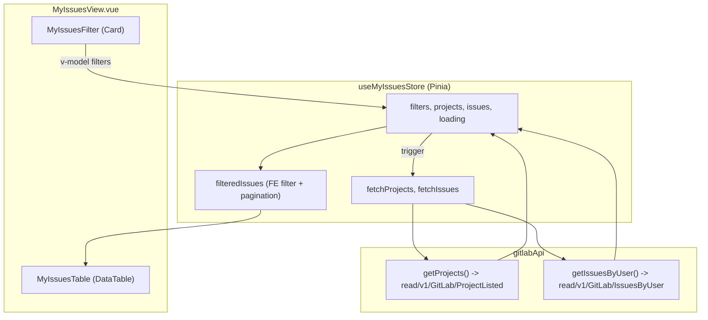

# My Issues Filter and Table Implementation

## Tong quan hien trang

- [MyIssuesView.vue](src/views/MyIssues/MyIssuesView.vue) hien chi la placeholder (h2 + p).
- Project su dung CQRS gateway pattern voi `gatewayService.read()` / `.command()` ([src/api/services/base.ts](src/api/services/base.ts)).
- `GITLAB_SERVICE` hien tai chi co `cmdVersion: 1` (thieu `readVersion`) ([src/config/services.ts](src/config/services.ts)).
- Form components da co san: `SelectField`, `InputNumberField`, etc. tu `@/components/common` ([src/components/common/form/](src/components/common/form/)).
- DataTable wrapper: `AppDataTable` + composable `useDataTable` hoat dong o che do **lazy/server-side** ([src/composables/useDataTable.ts](src/composables/useDataTable.ts)).

## Trang thai cuoi cung

## Cac thay doi cu the

### 1. Cap nhat `GITLAB_SERVICE` config - [src/config/services.ts](src/config/services.ts)

- Chuyen tu `ServiceCmdOnlyConfig` sang `ServiceConfig` (them `readVersion: 1` ben canh `cmdVersion: 1`).

### 2. Tao TypeScript types - `src/types/gitlab.ts` (file moi)

- `GitLabProject`: `{ id: number; name: string; path: string }`
- `GitLabProjectListResult`: `{ projects: GitLabProject[] }`
- `GitLabUser`: `{ id: number; name: string; username: string; avatarUrl: string; webUrl: string }`
- `GitLabMilestone`: `{ id: number; title: string; dueDate: string | null; startDate: string | null; releaseNumber: string; ... }`
- `GitLabIssue`: `{ id: number; title: string; issueNumber: number; description: string; dueDate: string | null; projectId: string; user: GitLabUser | null; assignees: GitLabUser[]; author: GitLabUser; labels: string[]; milestone: GitLabMilestone | null; webUrl: string }`
- `GitLabIssueListResult`: `{ issues: GitLabIssue[] }`
- `GitLabIssuesByUserRequest`: `{ projectId: number; issueState: number }`

### 3. Mo rong API layer - [src/api/services/gitlab.ts](src/api/services/gitlab.ts)

Them 2 methods vao `gitlabApi`:

- `getProjects()` -> `gatewayService.read<GitLabProjectListResult>(GITLAB_SERVICE, 'ProjectListed')`
- `getIssuesByUser(request)` -> `gatewayService.read<GitLabIssueListResult>(GITLAB_SERVICE, 'IssuesByUser', request)`

Cap nhat [src/api/index.ts](src/api/index.ts) de re-export cac types moi.

### 4. Tao Pinia store - `src/stores/myIssues.ts` (file moi)

- **State**: `projects`, `issues`, `loading`, `filters` (projectId, releaseNumber, region, status)
- **Computed**: `filteredIssues` - loc issues theo labels (region, status) va milestone (releaseNumber) o phia FE
- **Actions**: `fetchProjects()`, `fetchIssues()`, `applyFilters()`
- Pattern: Composition API (`defineStore('myIssues', () => { ... })`) giong [src/stores/auth.ts](src/stores/auth.ts)

### 5. Tao component `MyIssuesFilter` - `src/views/MyIssues/partials/MyIssuesFilter.vue` (file moi)

Su dung PrimeVue `Card` voi `#content` slot, ben trong la grid 4 cot:

- **Project Name**: `SelectField` voi `filter`, `show-clear`, options tu store `projects` (map sang `{ label: name, value: id }`)
- **Release Number**: `InputNumberField` voi `precision: 0`
- **Region**: `SelectField` voi options static `[{ label: 'VN', value: 'VN' }, { label: 'KR', value: 'KR' }]`
- **Status**: `SelectField` voi options static `[Todo, Verifying, Merging, ...]`

Component emit filter changes len parent hoac bind truc tiep voi store.

### 6. Tao component `MyIssuesTable` - `src/views/MyIssues/partials/MyIssuesTable.vue` (file moi)

- Su dung PrimeVue `DataTable` truc tiep (KHONG dung `AppDataTable` vi no force `lazy` mode, trong khi ta can **client-side pagination**)
- 4 cot: Issue No (`issueNumber`), Issue (`title`), Status (extract tu `labels`), Action
- **Action column**: 3 Button (Generate Branch, Start Coding, Create MR) - tam thoi chi emit event, chua xu ly logic
- Paginator built-in cua PrimeVue cho FE pagination
- Nhan data tu prop `issues` (da duoc filter tu store)

### 7. Cap nhat `MyIssuesView` - [src/views/MyIssues/MyIssuesView.vue](src/views/MyIssues/MyIssuesView.vue)

- Import va su dung `useMyIssuesStore`
- Goi `fetchProjects()` va `fetchIssues()` khi mounted
- Render `MyIssuesFilter` va `MyIssuesTable`
- Truyen `filteredIssues` tu store xuong `MyIssuesTable`

## Luu y quan trong

- **FE Pagination**: Vi API tra ve toan bo issues, pagination duoc xu ly hoan toan o client-side bang PrimeVue DataTable built-in (khong dung `lazy` mode).
- **Filter logic**: Region va Status duoc extract tu `labels[]` cua moi issue. Release Number duoc lay tu `milestone.releaseNumber`.
- **issueState mapping**: Can xac nhan mapping so (0, 1, 2...) tuong ung voi trang thai nao. Tam thoi su dung `0` nhu trong payload mau.

